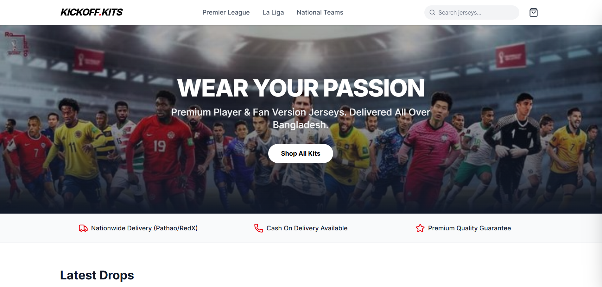
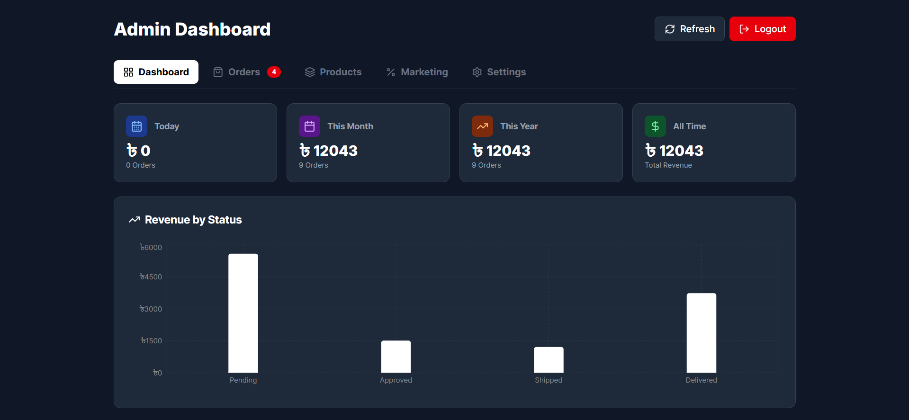

# ⚽ Kickoff Kits - Premium Jersey Store

A full-stack e-commerce platform built for selling premium football jerseys in Bangladesh. This project features a dynamic storefront for customers and a powerful admin dashboard for business operations, logistics, and analytics.


## 🚀 Features

### 🛒 Customer Storefront
- **Dynamic Product Catalog:** Filter by leagues (Premier League, La Liga, etc.) and search functionality.
- **Cart System:** LocalStorage-based cart with "Quick View" and size selection.
- **Checkout:** Streamlined cash-on-delivery (COD) checkout process.
- **Responsive Design:** Fully optimized for mobile and desktop using Tailwind CSS.
- **Social Sharing:** Optimized Open Graph (OG) tags for rich previews on WhatsApp/Facebook.

### ⚡ Admin Dashboard (The "Brain")
- **CMS Capabilities:** Edit homepage headlines and background images without coding.
- **Order Management:** Real-time workflow to Confirm, Ship, Deliver, or Cancel orders.
- **Logistics:** One-click **Printable Invoices** with auto-generated custom IDs (e.g., `#20260115-001`).
- **Analytics:** Visual charts for Daily, Monthly, and Yearly revenue tracking.
- **Marketing:** Create and track discount coupons (e.g., `MESSI10`).
- **Inventory Control:** Toggle stock status (In Stock / Sold Out) instantly.

---

## 📸 Screenshots

| Customer View | Admin Dashboard |
|:---:|:---:|
|  |  |

---

## 🛠️ Tech Stack

- **Framework:** [Next.js 14](https://nextjs.org/) (App Router)
- **Styling:** [Tailwind CSS](https://tailwindcss.com/)
- **Icons:** [Lucide React](https://lucide.dev/)
- **Database & Auth:** [Supabase](https://supabase.com/)
- **Charts:** [Recharts](https://recharts.org/)
- **Email Service:** [Resend](https://resend.com/) (Integrated)
- **Deployment:** [Vercel](https://vercel.com/)

## ⚡ Getting Started

### Installation

1. **Clone the repository**
   ```bash
   git clone [https://github.com/I-amAnonymous/kickoff-kits.git](https://github.com/I-amAnonymous/kickoff-kits.git)
   cd kickoff-kits

2. **Install Dependencies**
   ```bash
   npm install
3. **Set up Environment Variables**
   Create a `.env.local` file in the root directory:
   ```env
   NEXT_PUBLIC_SUPABASE_URL=your_supabase_url
   NEXT_PUBLIC_SUPABASE_ANON_KEY=your_supabase_anon_key
   RESEND_API_KEY=your_resend_api_key

4. **Run the development server**
   ```bash
   npm run dev


### 📂 Project Structure
src/
├── app/
│   ├── admin/         # Protected Admin Dashboard
│   ├── api/           # Backend API Routes (Order, Products, Auth)
│   ├── product/       # Dynamic Product Details Page
│   ├── layout.js      # Main Layout & SEO Configuration
│   └── page.js        # Homepage & Storefront Logic
├── components/        # Reusable UI Components
├── lib/               # Supabase Client Configuration
└── public/            # Static Assets (Images)

### 🤝 Contact
Shafayat - CS Student

Location: Dhaka, Bangladesh

Email: [shafayaturrahman1@gmail.com]
